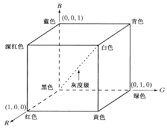
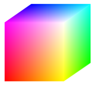

# 理解OpenCV中的图像、通道与颜色空间

因为opencv这种库，底层做的比较多，那网上的资料自然很多，那么我们更偏向理解，视觉作为一个高维信息，传输给电脑是一定降为过的，计算机看到的是3个矩阵，每个矩阵的元素在0-255区间，对应RGB三通道的图像，至今还不能理解到人们对图像，对视野的理解是如何的，但是我们通过一些数学物理方法，通过光学数学可以做一些简单的任务来模拟这一行为。
那我们先来理解一下图像

*
经典测试图 Lena.jpg (有兴趣可以自己搜一下)
*

## 1. 什么是颜色空间与通道？

我们从颜色空间讲起，每个图像都是由像素组成的，每个像素都是由颜色的组合组成的，更准确地说，就是原色。通道是彩色图像的灰度图像，它仅由构成彩色图像的一种原色组成。
那么怎么理解呢，我们通过RBG空间来讲，这也是很经典的一种空间，在RGB空间中，是由R，G，B三个通道构成的，每个通道只表示一种对应的颜色，R通道就表示这个通道图只看红色的明亮程度
                    
想象一下，在一个三维空间，有三个基向量，通过他们可以指向这个空间的任意一种颜色，那么所谓的通道，就是只看单一维度，而无视其他通道。
我们可以用opencv的split函数来实际的切割一下。
#b, g, r = cv2.split(image_bgr)
split输入一张多通道图像切割成RGB，由于 OpenCV 默认的颜色顺序是 BGR，所以它返回的顺序分别是 b (蓝色通道), g (绿色通道), r (红色通道)。

也可以在了解一下其他的颜色空间，不同的空间由不同的应用场景，比较重要的是HSV空间和LAB空间，用处相对广泛。
https://blog.csdn.net/weixin_43269204/article/details/94628987

灰度图像：灰度图像就是不包括图片颜色信息的图片，仅有一个灰度通道，在RGB空间中，灰度通道就是主对角线，只显示图像的明暗程度，单一通道在颜色特征不重要的情况下可以加快计算效率，既然以及知道这个通道是主对角线，那它的RGB三个值应该相等，他有三种计算方法，平均值最大值，和加权法。详细可以看以下链接
https://zhuanlan.zhihu.com/p/384374529

